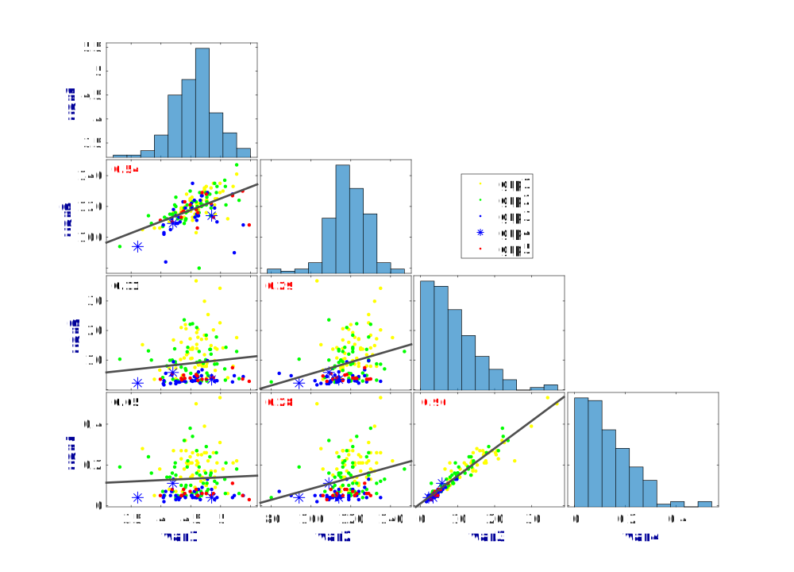
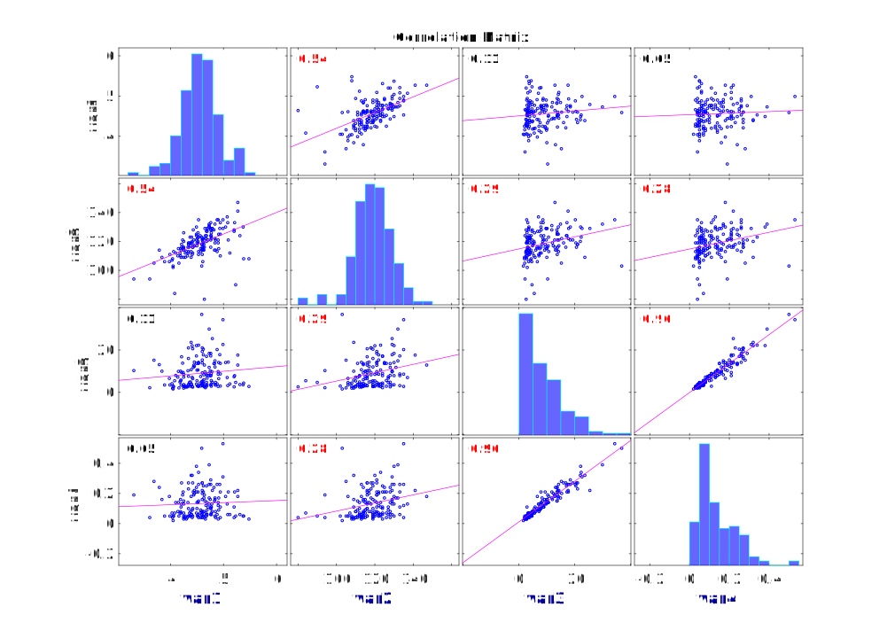

# corrplotg

Authors: Rene Labounek and Igor Nestrasil

Both from Division of Clinical Behavioral Neuroscience, Department of Pediatrics, University of Minnesota, Minneapolis, MN, USA

This is modification of original MATLAB function "corrplot" (part of the Econometrics Toolbox) enabling to visualize different groups of data samples in the correlation matrix graph. Code modifications were implemented in MATLAB version R2018b.

Example graph can be visualized with the script example_script.m

The ouput should appears as the figure below:

In direct comparison, the classic corrplot output appears as follows:

